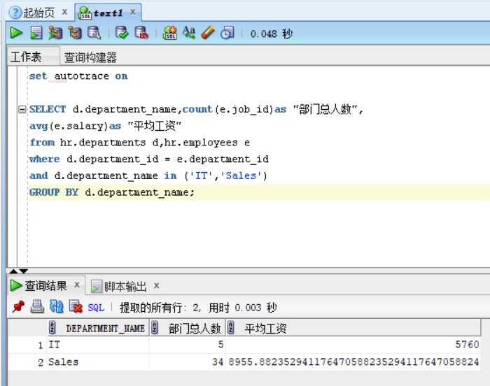
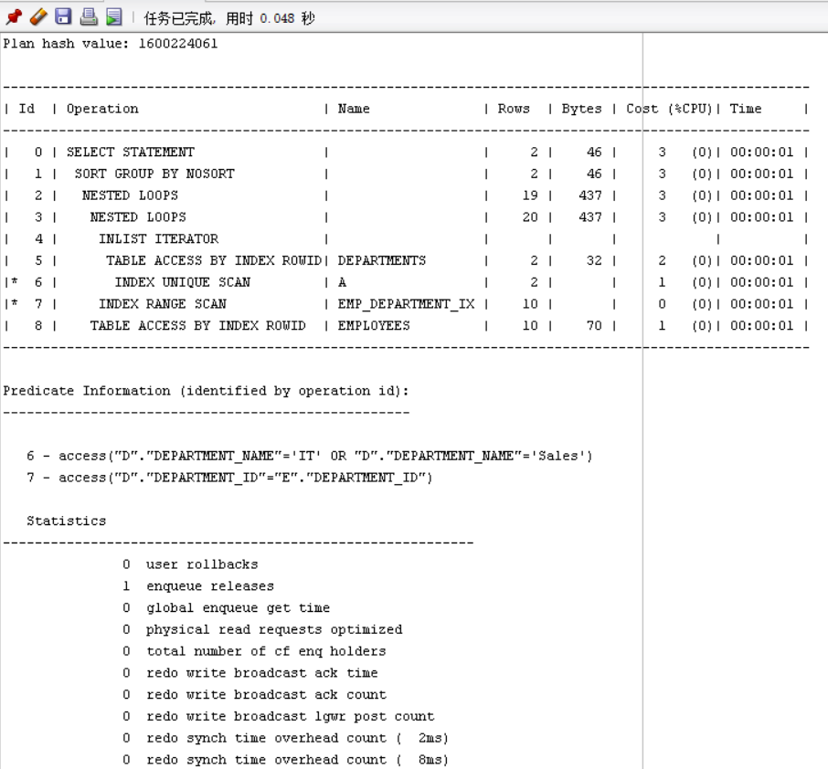
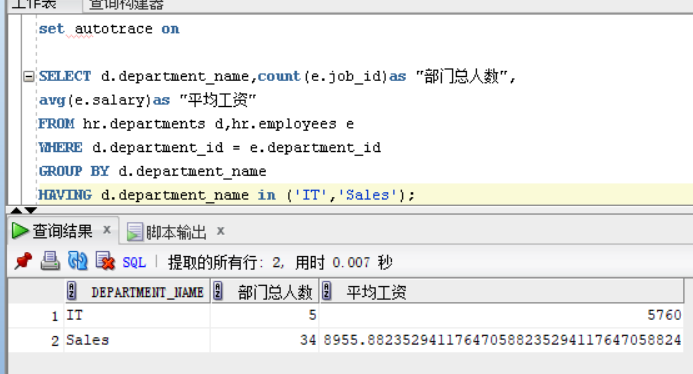
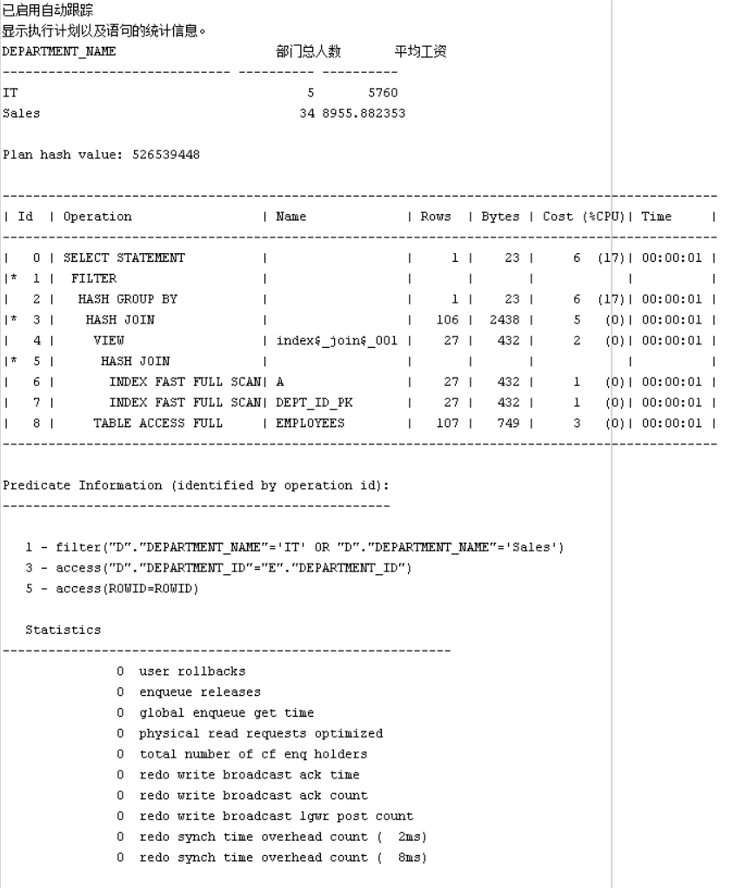
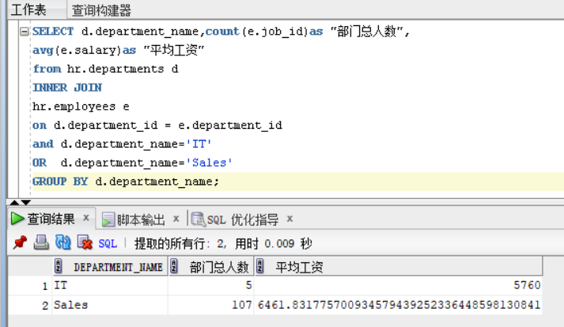
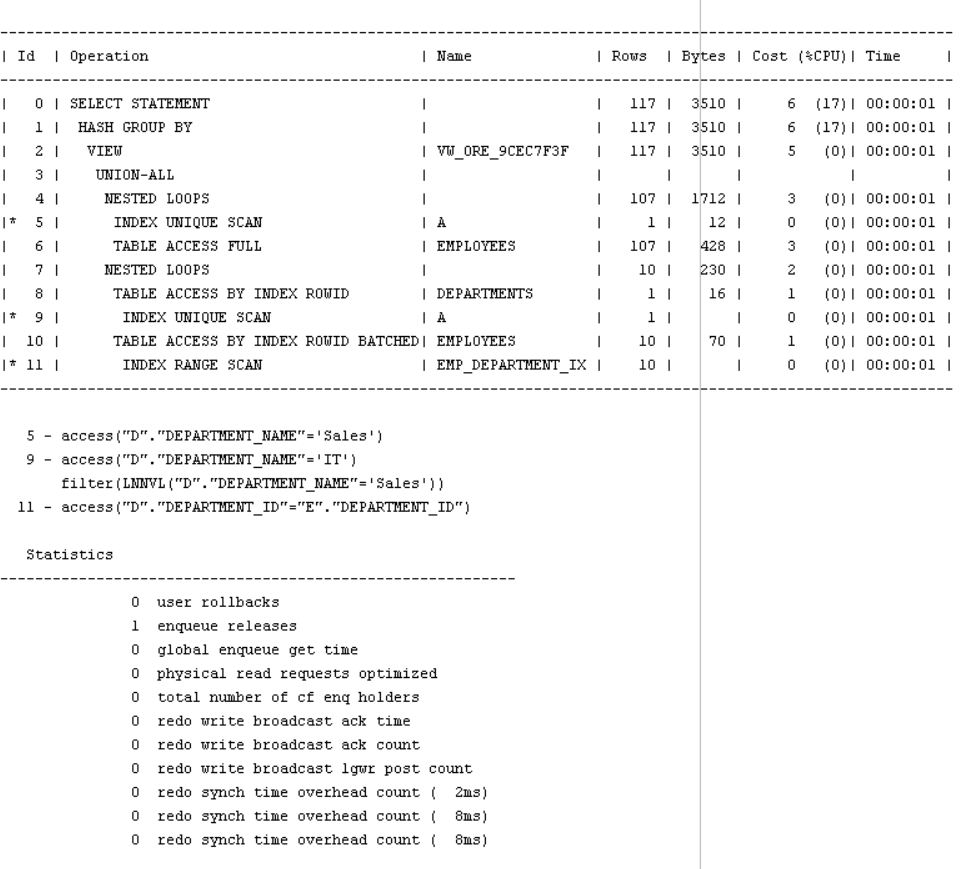

# 实验一：SQL语句的执行计划分析与优化指导

### 林明  201810414211  软件工程2班

## 实验目的

**分析SQL执行计划，执行SQL语句的优化指导。理解分析SQL语句的执行计划的重要作用。 **

## 实验内容

* 对Oracle12c中的HR人力资源管理系统中的表进行查询与分析。
- 首先运行和分析教材中的样例：本训练任务目的是查询两个部门('IT'和'Sales')的部门总人数和平均工资，以下两个查询的结果是一样的。但效率不相同。
- 设计自己的查询语句，并作相应的分析，查询语句不能太简单。

## 教材案例

* 查询1：

```SQL
set autotrace on

SELECT d.department_name,count(e.job_id)as "部门总人数",
avg(e.salary)as "平均工资"
from hr.departments d,hr.employees e
where d.department_id = e.department_id
and d.department_name in ('IT','Sales')
GROUP BY d.department_name;
```

运行结果





* 分析：从执行计划可以得到的信息：Rows=20，Cost=3，Predicate Information中有两次索引搜索access。

- 查询2

```SQL
set autotrace on

SELECT d.department_name,count(e.job_id)as "部门总人数",
avg(e.salary)as "平均工资"
FROM hr.departments d,hr.employees e
WHERE d.department_id = e.department_id
GROUP BY d.department_name
HAVING d.department_name in ('IT','Sales');
```

运行结果





* 分析：从执行计划可以得到的信息：Rows=107，Cost=6，Predicate Information中有两次索引搜索access，一次全表搜索filter。比较查询1和查询2的各项参数，查询1只有“enqueue releases=1”比查询2“enqueue releases=0”差一点，其余都优于查询2。查询1时先过滤后汇总，参与汇总的数据量少。而查询2十四线汇总后过滤，参与汇总的数据量多
* 优化建议：虽然创建推荐的索引可以显著地改进语句的执行计划，使得查询1比查询2更优，但是使用典型的SQL工作量运行“访问指导”可能比单个语句更可取。所以考虑运行可以改进物理方案设计的访问指导或创建推荐的索引。即在departments表上创建一个基于DEPARTMENT_NAME和DEPARTMENT_ID字段的索引，来加快查询DEPARTMENT_NAME。

## 个人查询语句

```sql
SELECT d.department_name,count(e.job_id)as "部门总人数",
avg(e.salary)as "平均工资"
from hr.departments d
INNER JOIN
hr.employees e
on d.department_id = e.department_id
and d.department_name='IT'
OR  d.department_name='Sales'
GROUP BY d.department_name;

```

运行结果





* 分析：从执行计划可以得到的信息：Rows=117，Cost=6，Predicate Information中有三次索引搜索access，一次全表搜索filter。

  