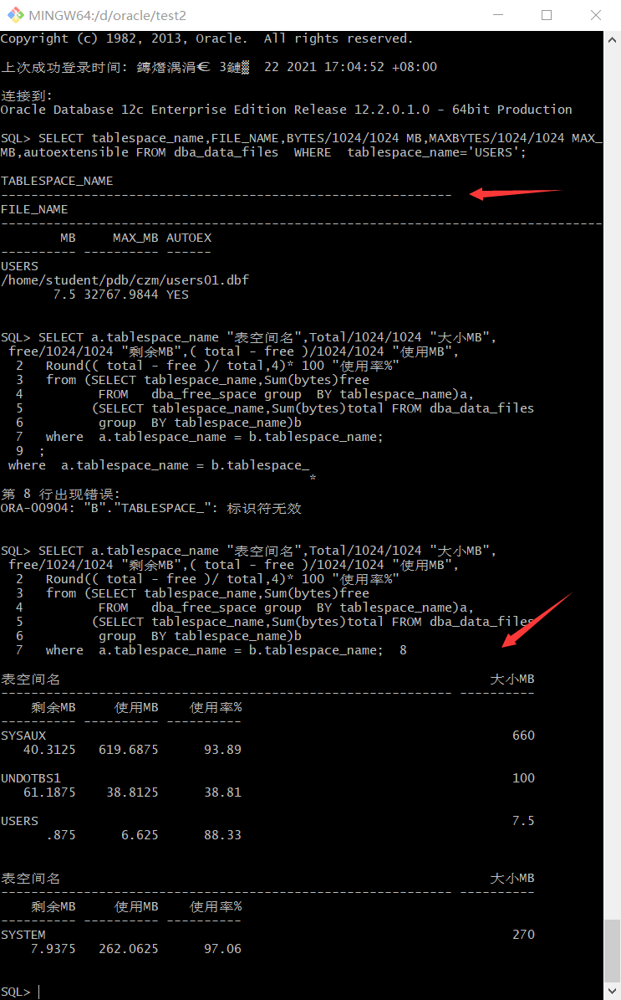

# 实验二：用户及权限管理

### 林明  201810414211  软件工程2班

## 实验目的

**掌握用户管理、角色管理、权根维护与分配的能力，掌握用户之间共享对象的操作技能。 **

## 实验内容

Oracle有一个开发者角色resource，可以创建表、过程、触发器等对象，但是不能创建视图。本训练要求：

- 在CZM插接式数据中创建一个新的本地角色con_res_view，该角色包含connect和resource角色，同时也包含CREATE VIEW权限，这样任何拥有con_res_view的用户就同时拥有这三种权限。
- 创建角色之后，再创建用户new_user，给用户分配表空间，设置限额为50M，授予con_res_view角色。
- 最后测试：用新用户new_user连接数据库、创建表，插入数据，创建视图，查询表和视图的数据。

## 实验步骤

对于以下的对象名称con_res_view，new_user，在实验的时候应该修改为自己的名称。

- 第1步：以system登录到CZM，创建角色con_res_view和用户new_user，并授权和分配空间：

<!--语句“ALTER USER new_user QUOTA 50M ON users;”是指授权new_user用户访问users表空间，空间限额是50M。-->

- 第2步：新用户new_user连接到CZM，创建表mytable和视图myview，插入数据，最后将myview的SELECT对象权限授予hr用户。

- 第3步：用户hr连接到CZM，查询new_user授予它的视图myview

### 数据库和表空间占用分析

当全班同学的实验都做完之后，数据库CZM中包含了每个同学的角色和用户。 所有同学的用户都使用表空间users存储表的数据。 表空间中存储了很多相同名称的表mytable和视图myview，但分别属性于不同的用户，不会引起混淆。 随着用户往表中插入数据，表空间的磁盘使用量会增加。

## 查看数据库的使用情况

以下样例查看表空间的数据库文件，以及每个文件的磁盘占用情况。

<!--autoextensible是显示表空间中的数据文件是否自动增加。-->

<!--MAX_MB是指数据文件的最大容量。-->

## 实验总结

本次实验，我是通过gitbush进行实验。通过老师给定的system系统用户创建了自己的用户，并成功授权给自己的用户。实验中遇到一个小问题，我的电脑的gitbush里默认不区分大小写。我写小写命令会报错，有时同样的代码也会报错，不知道原因是什么，重写一遍就没问题。有可能是不小心按了insert键，导致写命令时写错。