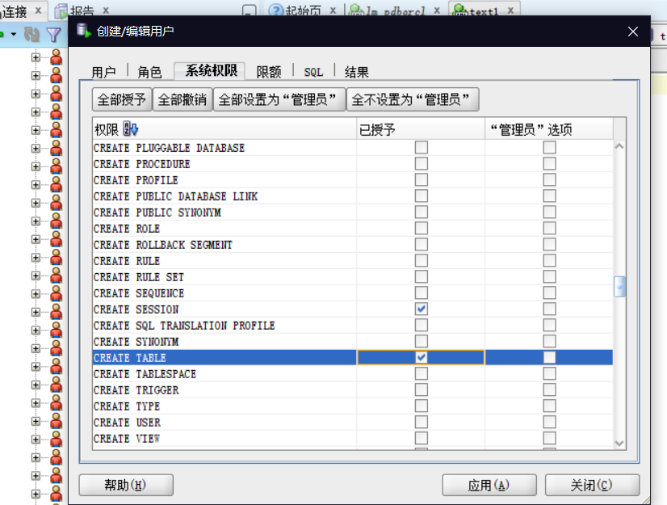

# 实验三：创建分区表

### 林明  201810414211  软件工程2班

## 实验目的

**掌握分区表的创建方法，掌握各种分区方式的使用场景。 **

## 实验内容

- 本实验使用3个表空间：USERS,USERS02,USERS03。在表空间中创建两张表：订单表(orders)与订单详表(order_details)。
- 使用**你自己的账号创建本实验的表**，表创建在上述3个分区，自定义分区策略。
- 你需要使用system用户给你自己的账号分配上述分区的使用权限。你需要使用system用户给你的用户分配可以查询执行计划的权限。
- 表创建成功后，插入数据，数据能并平均分布到各个分区。每个表的数据都应该大于1万行，对表进行联合查询。
- 写出插入数据的语句和查询数据的语句，并分析语句的执行计划。
- 进行分区与不分区的对比实验。

## 实验步骤

1.创建三个分区（先授予权限）

2.在主表orders和从表order_details之间建立引用分区。在study用户中创建两个表：orders（订单表）和order_details（订单详表），两个表通过列order_id建立主外键关联。orders表按范围分区进行存储，order_details使用引用分区进行存储。 

3.查询数据

由上图所示，orders表中的数据有30000行

4.查找orders中日期在2017-1-1到2018-6-1间的数据：

5.ORDER_ID,CUSTOMER_NAME,product_name,product_num,product_price(通过order_id进连表查询)

6.查看数据库使用情况

- autoextensible是显示表空间中的数据文件是否自动增加。
- MAX_MB是指数据文件的最大容量。

## 实验总结

​        本次实验，我掌握了分区表的创建方法和分区方式的使用场景。在实验过程中，我在运行sql脚本代码的时候，显示超出表空间“user”的最大限额，发现是对user 的限额是0，使用ALTER USER "LINMING" QUOTA UNLIMITED ON USERS;这条语句，对user的表空间不限额，问题解决。这使我对分区表的限额和最大空间的概念更加了解。