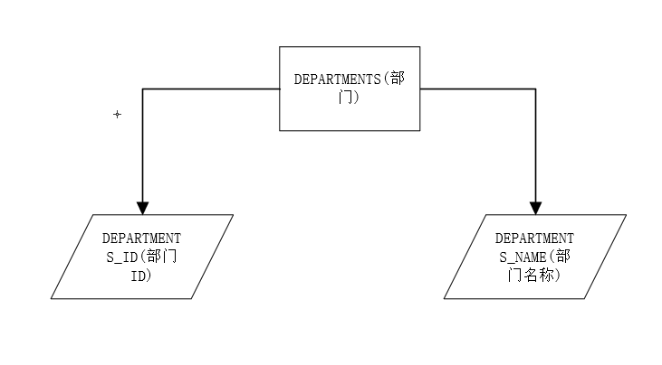
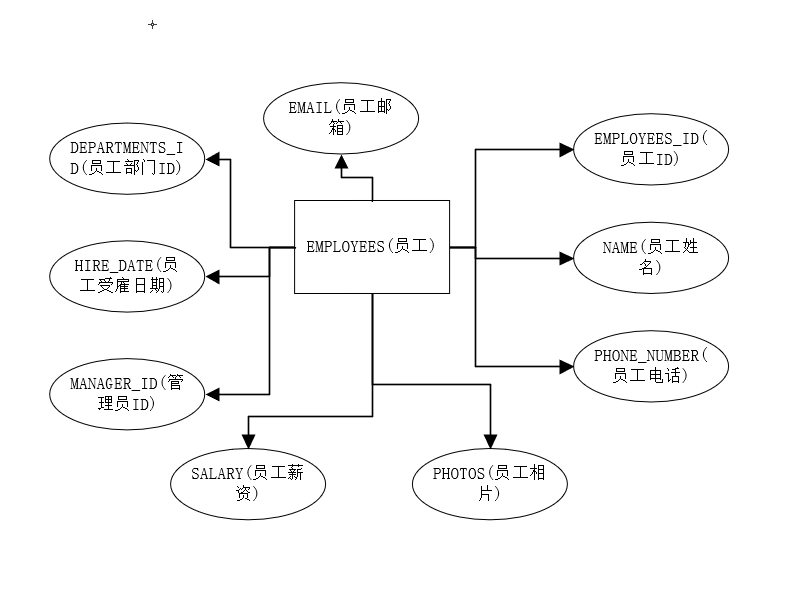
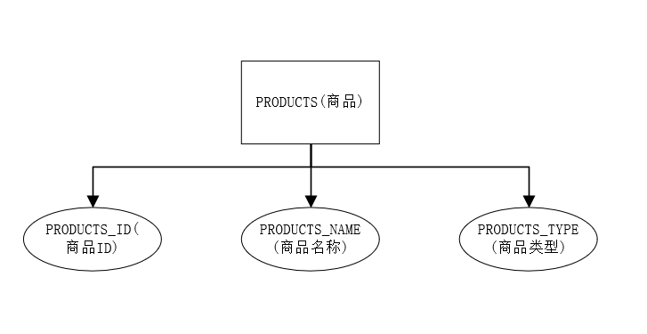
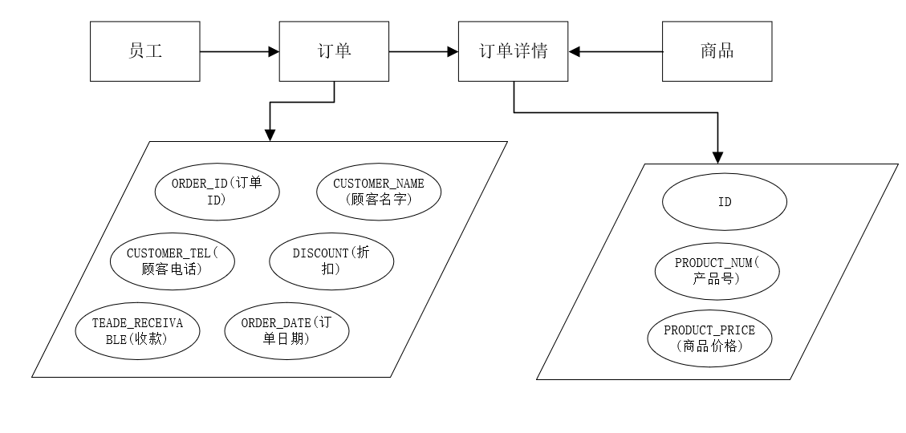

# 实验6：基于Oracle的线上水果销售数据库设计

### 林明  201810414211  软件工程2班

## 实验要求

- 自行设计一个信息系统的数据库项目，自拟`某项目`名称。
- 设计项目涉及的表及表空间使用方案。至少5张表和5万条数据，两个表空间。
- 设计权限及用户分配方案。至少两类角色，两个用户。
- 在数据库中建立一个程序包，在包中用PL/SQL语言设计一些存储过程和函数，实现比较复杂的业务逻辑，用模拟数据进行执行计划分析。
- 设计自动备份方案或则手工备份方案。
- 设计容灾方案。使用两台主机，通过DataGuard实现数据库整体的异地备份(可选)。

## 实验选题: 线上水果销售管理系统

## 实验内容

### 1 自行设计一个信息系统的数据库项目，自拟 某项目 名称

在21世纪，计算机技术迅速发展，如今每个公民都会使用计算机，从第一代计算机的产生到现在，我们经历了一个又一个奇迹的诞生.它从局部走向世界，从单位走向家庭.它不仅给我们的日常学习生活带来便利，还在军事，外交等方面做出了极大的贡献。大量的网上商城也随之而来，网上商城的数量也在快速增加，那么，这个线上水果销售管理系统是将IT技术用于水果销售信息的管理，它能收集和存储水果销售的档案信息，提供更新与检索销售信息档案的接口;来提高水果销售的工作效率。

线上水果销售管理系统：本系统包含员工表，部门表，订单表，订单详情表和商品表。

#### 1.1 E-R图设计

根据场景分析一共有3个实体：部门、员工、商品

部门



员工



商品



联系模型：订单表、订单详表

1


2



### 2 设计项目涉及的表及表空间使用方案。至少5张表和5万条数据，两个表空间

#### 2.1 设计数据表

DEPARTMENTS(部门)
|  字段名   | 数据类型   |  可以为NULL  |  注释                |
|  ----     |   ----    |     ----    | ----                |
| DEPARTMENT_ID  | NUMBER(6,0) | NO  | 部门ID,主键          |
| DEPARTMENT_NAME| VARCHAR2(40 BYTE) | NO  | 部门名称，非空 |

EMPLOYEES(员工)
|  字段名   | 数据类型   |  可以为NULL  |  注释                |
|  ----     |   ----    |     ----    | ----                |
| EMPLOYEE_ID  | NUMBER(6,0) | NO  | 员工ID,主键          |
|  MANE| VARCHAR2(40 BYTE) | NO  | 员工名字,不能为空，创建不唯一B树索引 |
| EMAIL | VARCHAR2(40 BYTE)  | YES  | 员工邮箱         |
| PHONE_NUMBER| VARCHAR2(40 BYTE) | YES  | 员工电话号码 |
| HIRE_DATE | DATE | NO  | 员工雇用日期     |
| SALARY| NUMBER(8,2) | YES  | 员工工资,>0 |
| DEPARTMENT_ID  | NUMBER(6,0) | YES  | 员工的部门ID,是DEPARTMENTS的外键          |
| PHOTO| BLOB | YES  | 员工照片 |
| MANAGER_ID| NUMBER(6,0) | YES  | 经理ID,员工表EMPLOYEES_ID 的外键 不能与EMPLOYEES_ID相等|

PRODUCTS(商品)
|  字段名   | 数据类型   |  可以为NULL  |  注释       |
|  ----     |   ----    |     ----    | ----       |
| PRODUCT_ID  | NUMBER(6,0) | NO  | 商品ID,主键    |
| PRODUCT_NAME| VARCHAR2(40 BYTE) | NO  | 商品名称 |
| PRODUCT_TYPE| VARCHAR2(40 BYTE) | NO  | 商品类型，只能取值：'食品', '饮料', '生活用品' |

ORDERS(订单)
|  字段名   | 数据类型   |  可以为NULL  |  注释       |
|  ----     |   ----    |     ----    | ----       |
| ORDER_ID  | NUMBER(10,0) | NO  | 订单ID,主键,值来自于SEQ_ORDER_ID|
| CUSTOMER_NAME| VARCHAR2(40 BYTE) | NO  | 客户名称，B数索引 |
| CUSTOMER_TEL| VARCHAR2(40 BYTE) | NO  | 客户电话 |
| ORDER_DATE  | DATE | NO  | 订单日期，应该采用分区储存方式 |
| EMPLOYEE_ID| NUMBER(6,0 | NO  | 订单经手人，员工表EMPLOYEES的外键|
| DISCOUNT| Number(8,2) | YES  | 订单整体优惠金额，默认为0 |
| TRADE_RECEIVABLE  | Number(8,2)  | YES  | 订单应收货款，默认为0    |

ORDERS_DETAILS(订单详单)
|  字段名   | 数据类型   |  可以为NULL  |  注释       |
|  ----     |   ----    |     ----    | ----       |
| ID  | NUMBER(10,0) | NO  | 订单详单ID,主键,值来自于SEQ_ORDER_ID|
| ORDER_ID| NUMBER(10,0) | NO  | 订单号，订单表ORDERS的外键 |
| PRODUCT_ID| VARCHAR2(40 BYTE) | NO  | 商品ID,商品表PRODUCTS的外键 |
| PRODUCT_NUM  | NUMBER(8,2) | NO  | 商品销售数量，>0|
| PRODUCT_PRICE| NUMBER(8,2) | NO  | 商品销售价格|

ORDERS_ID_TEMP(订单ID临时表)
|  字段名   | 数据类型   |  可以为NULL  |  注释       |
|  ----     |   ----    |     ----    | ----       |
| ORDER_ID  | NUMBER(10,0) | NO  | 主键|

#### 2.2 创建表空间 pdbtest_users02_1.dbf 与 pdbtest_users02_2.dbf

    CREATE TABLESPACE Users02
    DATAFILE
    '/home/oracle/app/oracle/oradata/orcl/pdborcl/pdbtest_users02_1.dbf'
    SIZE 100M AUTOEXTEND ON NEXT 256M MAXSIZE UNLIMITED,
    '/home/oracle/app/oracle/oradata/orcl/pdborcl/pdbtest_users02_2.dbf'
    SIZE 100M AUTOEXTEND ON NEXT 256M MAXSIZE UNLIMITED
    EXTENT MANAGEMENT LOCAL SEGMENT SPACE MANAGEMENT AUTO;

#### 2.3 创建用户YUKINO与DEEPSNOW

分配表空间pdbtest_users02_1.dbf 与 pdbtest_users02_2.dbf的使用配额，再分配角色CONNECT和RESOURCE,便于用户可以连接到数据库来创建资源，最后再分配一个系统权限："CREATE VIEW"，便于用户可以创建视图

    --创建用户YUKINO
    CREATE USER YUKINO IDENTIFIED BY 123
    DEFAULT TABLESPACE "USERS"
    TEMPORARY TABLESPACE "TEMP";
    
    -- QUOTAS
    ALTER USER YUKINO QUOTA UNLIMITED ON USERS;
    ALTER USER YUKINO QUOTA UNLIMITED ON USERS02;
    
    -- ROLES
    GRANT "CONNECT" TO YUKINO WITH ADMIN OPTION;
    GRANT "RESOURCE" TO YUKINO WITH ADMIN OPTION;
    ALTER USER YUKINO DEFAULT ROLE "CONNECT","RESOURCE";
    
    -- SYSTEM PRIVILEGES
    GRANT CREATE VIEW TO YUKINO WITH ADMIN OPTION;
    
    --创建用户DEEPSNOW
    CREATE USER DEEPSNOW IDENTIFIED BY 123
    DEFAULT TABLESPACE "USERS"
    TEMPORARY TABLESPACE "TEMP";
    
    -- QUOTAS
    ALTER USER DEEPSNOW QUOTA UNLIMITED ON USERS;
    ALTER USER DEEPSNOW QUOTA UNLIMITED ON USERS02;
    
    -- ROLES
    GRANT "CONNECT" TO DEEPSNOW WITH ADMIN OPTION;
    GRANT "RESOURCE" TO DEEPSNOW WITH ADMIN OPTION;
    ALTER USER DEEPSNOW DEFAULT ROLE "CONNECT","RESOURCE";
    
    -- SYSTEM PRIVILEGES
    GRANT CREATE VIEW TO DEEPSNOW WITH ADMIN OPTION;

#### 2.3 创建表

创建DEPARTMENTS表

    CREATE TABLE DEPARTMENTS
    (
    DEPARTMENT_ID NUMBER(6, 0) NOT NULL
    , DEPARTMENT_NAME VARCHAR2(40 BYTE) NOT NULL
    , CONSTRAINT DEPARTMENTS_PK PRIMARY KEY
    (
        DEPARTMENT_ID
    )
    USING INDEX
    (
        CREATE UNIQUE INDEX DEPARTMENTS_PK ON DEPARTMENTS (DEPARTMENT_ID ASC)
        NOLOGGING
        TABLESPACE USERS
        PCTFREE 10
        INITRANS 2
        STORAGE
        (
            INITIAL 65536
            NEXT 1048576
            MINEXTENTS 1
            MAXEXTENTS UNLIMITED
            BUFFER_POOL DEFAULT
        )
        NOPARALLEL
    )
    ENABLE
    )
    NOLOGGING
    TABLESPACE USERS
    PCTFREE 10
    INITRANS 1
    STORAGE
    (
    INITIAL 65536
    NEXT 1048576
    MINEXTENTS 1
    MAXEXTENTS UNLIMITED
    BUFFER_POOL DEFAULT
    )
    NOCOMPRESS NO INMEMORY NOPARALLEL;

创建EMPLOYEES表

    CREATE TABLE EMPLOYEES
    (
    EMPLOYEE_ID NUMBER(6, 0) NOT NULL
    , NAME VARCHAR2(40 BYTE) NOT NULL
    , EMAIL VARCHAR2(40 BYTE)
    , PHONE_NUMBER VARCHAR2(40 BYTE)
    , HIRE_DATE DATE NOT NULL
    , SALARY NUMBER(8, 2)
    , MANAGER_ID NUMBER(6, 0)
    , DEPARTMENT_ID NUMBER(6, 0)
    , PHOTO BLOB
    , CONSTRAINT EMPLOYEES_PK PRIMARY KEY
    (
        EMPLOYEE_ID
    )
    USING INDEX
    (
        CREATE UNIQUE INDEX EMPLOYEES_PK ON EMPLOYEES (EMPLOYEE_ID ASC)
        NOLOGGING
        TABLESPACE USERS
        PCTFREE 10
        INITRANS 2
        STORAGE
        (
            INITIAL 65536
            NEXT 1048576
            MINEXTENTS 1
            MAXEXTENTS UNLIMITED
            BUFFER_POOL DEFAULT
        )
        NOPARALLEL
    )
    ENABLE
    )
    NOLOGGING
    TABLESPACE USERS
    PCTFREE 10
    INITRANS 1
    STORAGE
    (
    INITIAL 65536
    NEXT 1048576
    MINEXTENTS 1
    MAXEXTENTS UNLIMITED
    BUFFER_POOL DEFAULT
    )
    NOCOMPRESS
    NO INMEMORY
    NOPARALLEL
    LOB (PHOTO) STORE AS SYS_LOB0000092017C00009$$
    (
    ENABLE STORAGE IN ROW
    CHUNK 8192
    NOCACHE
    NOLOGGING
    TABLESPACE USERS
    STORAGE
    (
        INITIAL 106496
        NEXT 1048576
        MINEXTENTS 1
        MAXEXTENTS UNLIMITED
        BUFFER_POOL DEFAULT
    )
    );
    
    CREATE INDEX EMPLOYEES_INDEX1_NAME ON EMPLOYEES (NAME ASC)
    NOLOGGING
    TABLESPACE USERS
    PCTFREE 10
    INITRANS 2
    STORAGE
    (
    INITIAL 65536
    NEXT 1048576
    MINEXTENTS 1
    MAXEXTENTS UNLIMITED
    BUFFER_POOL DEFAULT
    )
    NOPARALLEL;
    
    ALTER TABLE EMPLOYEES
    ADD CONSTRAINT EMPLOYEES_FK1 FOREIGN KEY
    (
    DEPARTMENT_ID
    )
    REFERENCES DEPARTMENTS
    (
    DEPARTMENT_ID
    )
    ENABLE;
    
    ALTER TABLE EMPLOYEES
    ADD CONSTRAINT EMPLOYEES_FK2 FOREIGN KEY
    (
    MANAGER_ID
    )
    REFERENCES EMPLOYEES
    (
    EMPLOYEE_ID
    )
    ON DELETE SET NULL ENABLE;
    
    ALTER TABLE EMPLOYEES
    ADD CONSTRAINT EMPLOYEES_CHK1 CHECK
    (SALARY>0)
    ENABLE;
    
    ALTER TABLE EMPLOYEES
    ADD CONSTRAINT EMPLOYEES_CHK2 CHECK
    (EMPLOYEE_ID<>MANAGER_ID)
    ENABLE;
    
    ALTER TABLE EMPLOYEES
    ADD CONSTRAINT EMPLOYEES_EMPLOYEE_MANAGER_ID CHECK
    (MANAGER_ID<>EMPLOYEE_ID)
    ENABLE;
    
    ALTER TABLE EMPLOYEES
    ADD CONSTRAINT EMPLOYEES_SALARY CHECK
    (SALARY>0)
    ENABLE;

创建PRODUCTS表

    CREATE TABLE PRODUCTS
    (
    PRODUCT_NAME VARCHAR2(40 BYTE) NOT NULL
    , PRODUCT_TYPE VARCHAR2(40 BYTE) NOT NULL
    , CONSTRAINT PRODUCTS_PK PRIMARY KEY
    (
        PRODUCT_NAME
    )
    ENABLE
    )
    LOGGING
    TABLESPACE "USERS"
    PCTFREE 10
    INITRANS 1
    STORAGE
    (
    INITIAL 65536
    NEXT 1048576
    MINEXTENTS 1
    MAXEXTENTS 2147483645
    BUFFER_POOL DEFAULT
    );
    
    ALTER TABLE PRODUCTS
    ADD CONSTRAINT PRODUCTS_CHK1 CHECK
    (PRODUCT_TYPE IN ('食品', '饮料', '生活用品'))
    ENABLE;

创建ORDERS表及相关表, 表空间：分区表：USERS,USERS02

    CREATE GLOBAL TEMPORARY TABLE "ORDER_ID_TEMP"
    ("ORDER_ID" NUMBER(10,0) NOT NULL ENABLE,
        CONSTRAINT "ORDER_ID_TEMP_PK" PRIMARY KEY ("ORDER_ID") ENABLE
    ) ON COMMIT DELETE ROWS ;
    
    COMMENT ON TABLE "ORDER_ID_TEMP"  IS '用于触发器存储临时ORDER_ID';
    
    CREATE TABLE ORDERS
    (
    ORDER_ID NUMBER(10, 0) NOT NULL
    , CUSTOMER_NAME VARCHAR2(40 BYTE) NOT NULL
    , CUSTOMER_TEL VARCHAR2(40 BYTE) NOT NULL
    , ORDER_DATE DATE NOT NULL
    , EMPLOYEE_ID NUMBER(6, 0) NOT NULL
    , DISCOUNT NUMBER(8, 2) DEFAULT 0
    , TRADE_RECEIVABLE NUMBER(8, 2) DEFAULT 0
    )
    TABLESPACE USERS
    PCTFREE 10
    INITRANS 1
    STORAGE
    (
    BUFFER_POOL DEFAULT
    )
    NOCOMPRESS
    NOPARALLEL
    PARTITION BY RANGE (ORDER_DATE)
    (
    PARTITION PARTITION_BEFORE_2016 VALUES LESS THAN (TO_DATE(' 2016-01-01 00:00:00', 'SYYYY-MM-DD HH24:MI:SS', 'NLS_CALENDAR=GREGORIAN'))
    NOLOGGING
    TABLESPACE USERS
    PCTFREE 10
    INITRANS 1
    STORAGE
    (
        INITIAL 8388608
        NEXT 1048576
        MINEXTENTS 1
        MAXEXTENTS UNLIMITED
        BUFFER_POOL DEFAULT
    )
    NOCOMPRESS NO INMEMORY
    , PARTITION PARTITION_BEFORE_2017 VALUES LESS THAN (TO_DATE(' 2017-01-01 00:00:00', 'SYYYY-MM-DD HH24:MI:SS', 'NLS_CALENDAR=GREGORIAN'))
    NOLOGGING
    TABLESPACE USERS02
    PCTFREE 10
    INITRANS 1
    STORAGE
    (
        INITIAL 8388608
        NEXT 1048576
        MINEXTENTS 1
        MAXEXTENTS UNLIMITED
        BUFFER_POOL DEFAULT
    )
    NOCOMPRESS NO INMEMORY
    );

--创建本地分区索引ORDERS_INDEX_DATE：

    CREATE INDEX ORDERS_INDEX_DATE ON ORDERS (ORDER_DATE ASC)
    LOCAL
    (
    PARTITION PARTITION_BEFORE_2016
        TABLESPACE USERS
        PCTFREE 10
        INITRANS 2
        STORAGE
        (
        INITIAL 8388608
        NEXT 1048576
        MINEXTENTS 1
        MAXEXTENTS UNLIMITED
        BUFFER_POOL DEFAULT
        )
        NOCOMPRESS
    , PARTITION PARTITION_BEFORE_2017
        TABLESPACE USERS02
        PCTFREE 10
        INITRANS 2
        STORAGE
        (
        INITIAL 8388608
        NEXT 1048576
        MINEXTENTS 1
        MAXEXTENTS UNLIMITED
        BUFFER_POOL DEFAULT
        )
        NOCOMPRESS
    )
    STORAGE
    (
    BUFFER_POOL DEFAULT
    )
    NOPARALLEL;
    
    CREATE INDEX ORDERS_INDEX_CUSTOMER_NAME ON ORDERS (CUSTOMER_NAME ASC)
    NOLOGGING
    TABLESPACE USERS
    PCTFREE 10
    INITRANS 2
    STORAGE
    (
    INITIAL 65536
    NEXT 1048576
    MINEXTENTS 1
    MAXEXTENTS UNLIMITED
    BUFFER_POOL DEFAULT
    )
    NOPARALLEL;
    
    CREATE UNIQUE INDEX ORDERS_PK ON ORDERS (ORDER_ID ASC)
    GLOBAL PARTITION BY HASH (ORDER_ID)
    (
    PARTITION INDEX_PARTITION1 TABLESPACE USERS
        NOCOMPRESS
    , PARTITION INDEX_PARTITION2 TABLESPACE USERS02
        NOCOMPRESS
    )
    NOLOGGING
    TABLESPACE USERS
    PCTFREE 10
    INITRANS 2
    STORAGE
    (
    INITIAL 65536
    NEXT 1048576
    MINEXTENTS 1
    MAXEXTENTS UNLIMITED
    BUFFER_POOL DEFAULT
    )
    NOPARALLEL;
    
    ALTER TABLE ORDERS
    ADD CONSTRAINT ORDERS_PK PRIMARY KEY
    (
    ORDER_ID
    )
    USING INDEX ORDERS_PK
    ENABLE;
    
    ALTER TABLE ORDERS
    ADD CONSTRAINT ORDERS_FK1 FOREIGN KEY
    (
    EMPLOYEE_ID
    )
    REFERENCES EMPLOYEES
    (
    EMPLOYEE_ID
    )
    ENABLE;
    
    CREATE TABLE ORDER_DETAILS
    (
    ID NUMBER(10, 0) NOT NULL
    , ORDER_ID NUMBER(10, 0) NOT NULL
    , PRODUCT_NAME VARCHAR2(40 BYTE) NOT NULL
    , PRODUCT_NUM NUMBER(8, 2) NOT NULL
    , PRODUCT_PRICE NUMBER(8, 2) NOT NULL
    , CONSTRAINT ORDER_DETAILS_FK1 FOREIGN KEY
    (
    ORDER_ID
    )
    REFERENCES ORDERS
    (
    ORDER_ID
    )
    ENABLE
    )
    TABLESPACE USERS
    PCTFREE 10
    INITRANS 1
    STORAGE
    (
    BUFFER_POOL DEFAULT
    )
    NOCOMPRESS
    NOPARALLEL
    PARTITION BY REFERENCE (ORDER_DETAILS_FK1)
    (
    PARTITION PARTITION_BEFORE_2016
    NOLOGGING
    TABLESPACE USERS 
    --必须指定表空间，否则会将分区存储在用户的默认表空间中
    PCTFREE 10
    INITRANS 1
    STORAGE
    (
        INITIAL 8388608
        NEXT 1048576
        MINEXTENTS 1
        MAXEXTENTS UNLIMITED
        BUFFER_POOL DEFAULT
    )
    NOCOMPRESS NO INMEMORY,
    PARTITION PARTITION_BEFORE_2017
    NOLOGGING
    TABLESPACE USERS02
    PCTFREE 10
    INITRANS 1
    STORAGE
    (
        INITIAL 8388608
        NEXT 1048576
        MINEXTENTS 1
        MAXEXTENTS UNLIMITED
        BUFFER_POOL DEFAULT
    )
    NOCOMPRESS NO INMEMORY
    )
    ;
    
    CREATE UNIQUE INDEX ORDER_DETAILS_PK ON ORDER_DETAILS (ID ASC)
    NOLOGGING
    TABLESPACE USERS
    PCTFREE 10
    INITRANS 2
    STORAGE
    (
    INITIAL 65536
    NEXT 1048576
    MINEXTENTS 1
    MAXEXTENTS UNLIMITED
    BUFFER_POOL DEFAULT
    )
    NOPARALLEL;
    
    ALTER TABLE ORDER_DETAILS
    ADD CONSTRAINT ORDER_DETAILS_PK PRIMARY KEY
    (
    ID
    )
    USING INDEX ORDER_DETAILS_PK
    ENABLE;

--这个索引可以使整个订单的详单存放在一起

    CREATE INDEX ORDER_DETAILS_ORDER_ID ON ORDER_DETAILS (ORDER_ID)
    GLOBAL PARTITION BY HASH (ORDER_ID)
    (
    PARTITION INDEX_PARTITION1 TABLESPACE USERS
        NOCOMPRESS
    , PARTITION INDEX_PARTITION2 TABLESPACE USERS02
        NOCOMPRESS
    );
    
    ALTER TABLE ORDER_DETAILS
    ADD CONSTRAINT ORDER_DETAILS_PRODUCT_NUM CHECK
    (Product_Num>0)
    ENABLE;

创建3个触发器

    CREATE OR REPLACE EDITIONABLE TRIGGER "ORDERS_TRIG_ROW_LEVEL"
    BEFORE INSERT OR UPDATE OF DISCOUNT ON "ORDERS"
    FOR EACH ROW --行级触发器
    declare
    m number(8,2);
    BEGIN
    if inserting then
        :new.TRADE_RECEIVABLE := - :new.discount;
    else
        select sum(PRODUCT_NUM*PRODUCT_PRICE) into m from ORDER_DETAILS where ORDER_ID=:old.ORDER_ID;
        if m is null then
            m:=0;
        end if;
        :new.TRADE_RECEIVABLE := m - :new.discount;
    end if;
    END;
    /
--批量插入订单数据之前，禁用触发器

    ALTER TRIGGER "ORDERS_TRIG_ROW_LEVEL" DISABLE;
    
    CREATE OR REPLACE EDITIONABLE TRIGGER "ORDER_DETAILS_ROW_TRIG"
    AFTER DELETE OR INSERT OR UPDATE  ON ORDER_DETAILS
    FOR EACH ROW
    BEGIN
    --DBMS_OUTPUT.PUT_LINE(:NEW.ORDER_ID);
    IF :NEW.ORDER_ID IS NOT NULL THEN
        MERGE INTO ORDER_ID_TEMP A
        USING (SELECT 1 FROM DUAL) B
        ON (A.ORDER_ID=:NEW.ORDER_ID)
        WHEN NOT MATCHED THEN
        INSERT (ORDER_ID) VALUES(:NEW.ORDER_ID);
    END IF;
    IF :OLD.ORDER_ID IS NOT NULL THEN
        MERGE INTO ORDER_ID_TEMP A
        USING (SELECT 1 FROM DUAL) B
        ON (A.ORDER_ID=:OLD.ORDER_ID)
        WHEN NOT MATCHED THEN
        INSERT (ORDER_ID) VALUES(:OLD.ORDER_ID);
    END IF;
    END;
    /
    ALTER TRIGGER "ORDER_DETAILS_ROW_TRIG" DISABLE;
    
    CREATE OR REPLACE EDITIONABLE TRIGGER "ORDER_DETAILS_SNTNS_TRIG"
    AFTER DELETE OR INSERT OR UPDATE ON ORDER_DETAILS
    declare
    m number(8,2);
    BEGIN
    FOR R IN (SELECT ORDER_ID FROM ORDER_ID_TEMP)
    LOOP
        --DBMS_OUTPUT.PUT_LINE(R.ORDER_ID);
        select sum(PRODUCT_NUM*PRODUCT_PRICE) into m from ORDER_DETAILS
        where ORDER_ID=R.ORDER_ID;
        if m is null then
        m:=0;
        end if;
        UPDATE ORDERS SET TRADE_RECEIVABLE = m - discount
        WHERE ORDER_ID=R.ORDER_ID;
    END LOOP;
    --delete from ORDER_ID_TEMP;
    END;
    /
    ALTER TRIGGER "ORDER_DETAILS_SNTNS_TRIG" DISABLE;
    
    CREATE SEQUENCE  "SEQ_ORDER_ID"  MINVALUE 1 MAXVALUE 9999999999 INCREMENT BY 1 START WITH 1 CACHE 2000 ORDER  NOCYCLE  NOPARTITION ;
    
    CREATE SEQUENCE  "SEQ_ORDER_DETAILS_ID"  MINVALUE 1 MAXVALUE 9999999999 INCREMENT BY 1 START WITH 1 CACHE 2000 ORDER  NOCYCLE  NOPARTITION ;
    
    CREATE OR REPLACE FORCE EDITIONABLE VIEW "VIEW_ORDER_DETAILS" ("ID", "ORDER_ID", "CUSTOMER_NAME", "CUSTOMER_TEL", "ORDER_DATE", "PRODUCT_TYPE", "PRODUCT_NAME", "PRODUCT_NUM", "PRODUCT_PRICE") AS
    SELECT
    d.ID,
    o.ORDER_ID,
    o.CUSTOMER_NAME,o.CUSTOMER_TEL,o.ORDER_DATE,
    p.PRODUCT_TYPE,
    d.PRODUCT_NAME,
    d.PRODUCT_NUM,
    d.PRODUCT_PRICE
    FROM ORDERS o,ORDER_DETAILS d,PRODUCTS p where d.ORDER_ID=o.ORDER_ID and d.PRODUCT_NAME=p.PRODUCT_NAME;
    /

插入DEPARTMENTS，EMPLOYEES数据

    INSERT INTO DEPARTMENTS(DEPARTMENT_ID,DEPARTMENT_NAME) values (1,'总经办');
    INSERT INTO EMPLOYEES(EMPLOYEE_ID,NAME,EMAIL,PHONE_NUMBER,HIRE_DATE,SALARY,MANAGER_ID,DEPARTMENT_ID)
    VALUES (1,'阳董事长',NULL,NULL,to_date('2012-1-1','yyyy-mm-dd'),50000,NULL,1);
    
    INSERT INTO DEPARTMENTS(DEPARTMENT_ID,DEPARTMENT_NAME) values (11,'销售部');
    INSERT INTO EMPLOYEES(EMPLOYEE_ID,NAME,EMAIL,PHONE_NUMBER,HIRE_DATE,SALARY,MANAGER_ID,DEPARTMENT_ID)
    VALUES (11,'张总',NULL,NULL,to_date('2012-1','yyyy-mm-dd'),50000,1,1);
    INSERT INTO EMPLOYEES(EMPLOYEE_ID,NAME,EMAIL,PHONE_NUMBER,HIRE_DATE,SALARY,MANAGER_ID,DEPARTMENT_ID)
    VALUES (111,'陈经理',NULL,NULL,to_date('2012-1','yyyy-mm-dd'),50000,11,11);
    INSERT INTO EMPLOYEES(EMPLOYEE_ID,NAME,EMAIL,PHONE_NUMBER,HIRE_DATE,SALARY,MANAGER_ID,DEPARTMENT_ID)
    VALUES (112,'刘经理',NULL,NULL,to_date('2012-1-1','yyyy-mm-dd'),50000,11,11);
    
    INSERT INTO DEPARTMENTS(DEPARTMENT_ID,DEPARTMENT_NAME) values (12,'主管部');
    INSERT INTO EMPLOYEES(EMPLOYEE_ID,NAME,EMAIL,PHONE_NUMBER,HIRE_DATE,SALARY,MANAGER_ID,DEPARTMENT_ID)
    VALUES (12,'赵总',NULL,NULL,to_date('2012-1-1','yyyy-mm-dd'),50000,1,1);
    INSERT INTO EMPLOYEES(EMPLOYEE_ID,NAME,EMAIL,PHONE_NUMBER,HIRE_DATE,SALARY,MANAGER_ID,DEPARTMENT_ID)
    VALUES (121,'朱经理',NULL,NULL,to_date('2012-1-1','yyyy-mm-dd'),50000,12,12);
    INSERT INTO EMPLOYEES(EMPLOYEE_ID,NAME,EMAIL,PHONE_NUMBER,HIRE_DATE,SALARY,MANAGER_ID,DEPARTMENT_ID)
    VALUES (122,'李经理',NULL,NULL,to_date('2012-1-1','yyyy-mm-dd'),50000,12,12);
    
    insert into products (product_name,product_type) values ('food1','食品');
    insert into products (product_name,product_type) values ('food2','食品');
    insert into products (product_name,product_type) values ('food3','食品');
    
    insert into products (product_name,product_type) values ('drinks1','饮料');
    insert into products (product_name,product_type) values ('drinks2','饮料');
    insert into products (product_name,product_type) values ('drinks3','饮料');
    
    insert into products (product_name,product_type) values ('articles of daily use1','生活用品');
    insert into products (product_name,product_type) values ('articles of daily use2','生活用品');
    insert into products (product_name,product_type) values ('articles of daily use3','生活用品');

批量插入订单数据，注意ORDERS.TRADE_RECEIVABLE（订单应收款）的自动计算

    declare
    dt date;
    m number(8,2);
    V_EMPLOYEE_ID NUMBER(6);
    v_order_id number(10);
    v_name varchar2(100);
    v_tel varchar2(100);
    v number(10,2);
    
    begin
    for i in 1..50000
    loop
        if i mod 2 =0 then
        dt:=to_date('2015-3-2','yyyy-mm-dd')+(i mod 60);
        else
        dt:=to_date('2016-3-2','yyyy-mm-dd')+(i mod 60);
        end if;
        V_EMPLOYEE_ID:=CASE I MOD 6 WHEN 0 THEN 11 WHEN 1 THEN 111 WHEN 2 THEN 112
                                    WHEN 3 THEN 12 WHEN 4 THEN 121 ELSE 122 END;
        --插入订单
        v_order_id:=SEQ_ORDER_ID.nextval; 
        v_name := 'aa'|| 'aa';
        v_name := 'Miku' || i;
        v_tel := '138923483' || i;
        insert /*+append*/ into ORDERS (ORDER_ID,CUSTOMER_NAME,CUSTOMER_TEL,ORDER_DATE,EMPLOYEE_ID,DISCOUNT)
        values (v_order_id,v_name,v_tel,dt,V_EMPLOYEE_ID,dbms_random.value(100,0));
        --插入订单y一个订单包括3个商品
        v:=dbms_random.value(10000,4000);
        v_name:='food'|| (i mod 3 + 1);
        insert /*+append*/ into ORDER_DETAILS(ID,ORDER_ID,PRODUCT_NAME,PRODUCT_NUM,PRODUCT_PRICE)
        values (SEQ_ORDER_DETAILS_ID.NEXTVAL,v_order_id,v_name,2,v);
        v:=dbms_random.value(1000,50);
        v_name:='drinks'|| (i mod 3 + 1);
        insert /*+append*/ into ORDER_DETAILS(ID,ORDER_ID,PRODUCT_NAME,PRODUCT_NUM,PRODUCT_PRICE)
        values (SEQ_ORDER_DETAILS_ID.NEXTVAL,v_order_id,v_name,3,v);
        v:=dbms_random.value(9000,2000);
        v_name:='articles of daily use'|| (i mod 3 + 1);
        insert /*+append*/ into ORDER_DETAILS(ID,ORDER_ID,PRODUCT_NAME,PRODUCT_NUM,PRODUCT_PRICE)
        values (SEQ_ORDER_DETAILS_ID.NEXTVAL,v_order_id,v_name,1,v);
        select sum(PRODUCT_NUM*PRODUCT_PRICE) into m from ORDER_DETAILS where ORDER_ID=v_order_id;
        if m is null then
        m:=0;
        end if;
        UPDATE ORDERS SET TRADE_RECEIVABLE = m - discount WHERE ORDER_ID=v_order_id;
        IF I MOD 1000 =0 THEN
        commit; 
        END IF;
    end loop;
    end;
    /
    
    ALTER TRIGGER "ORDERS_TRIG_ROW_LEVEL" ENABLE;
    ALTER TRIGGER "ORDER_DETAILS_SNTNS_TRIG" ENABLE;
    ALTER TRIGGER "ORDER_DETAILS_ROW_TRIG" ENABLE;

最后动态增加一个PARTITION_BEFORE_2021分区：

    ALTER TABLE ORDERS
    ADD PARTITION PARTITION_BEFORE_2018 VALUES LESS THAN (TO_DATE(' 2021-01-01 00:00:00', 'SYYYY-MM-DD HH24:MI:SS', 'NLS_CALENDAR=GREGORIAN'));
    
    ALTER INDEX ORDERS_INDEX_DATE
    MODIFY PARTITION PARTITION_BEFORE_2018
    NOCOMPRESS;

#### 2.4 在数据库中建立一个程序包

在包中用PL/SQL语言设计一些存储过程和函数，实现比较复杂的业务逻辑，用模拟数据进行执行计划分析。

    create or replace PACKAGE SPM_Pack IS
    /*
    包SPM_Pack中有：
    一个函数:Get_SaleAmount(V_DEPARTMENT_ID NUMBER)，
    一个过程:Get_Employees(V_EMPLOYEE_ID NUMBER)
    */
    FUNCTION Get_SaleAmount(V_DEPARTMENT_ID NUMBER) RETURN NUMBER;
    PROCEDURE Get_Employees(V_EMPLOYEE_ID NUMBER);
    END SPM_Pack;
    /
    create or replace PACKAGE BODY SPM_Pack IS
    FUNCTION Get_SaleAmount(V_DEPARTMENT_ID NUMBER) RETURN NUMBER
    AS
        N NUMBER(20,2);
        BEGIN
        SELECT SUM(O.TRADE_RECEIVABLE) into N  FROM ORDERS O,EMPLOYEES E
        WHERE O.EMPLOYEE_ID=E.EMPLOYEE_ID AND E.DEPARTMENT_ID =V_DEPARTMENT_ID;
        RETURN N;
        END;
    
    PROCEDURE GET_EMPLOYEES(V_EMPLOYEE_ID NUMBER)
    AS
        LEFTSPACE VARCHAR(2000);
        begin
        LEFTSPACE:=' ';
        for v in
        (SELECT LEVEL,EMPLOYEE_ID,NAME,MANAGER_ID FROM employees
        START WITH EMPLOYEE_ID = V_EMPLOYEE_ID
        CONNECT BY PRIOR EMPLOYEE_ID = MANAGER_ID)
        LOOP
            DBMS_OUTPUT.PUT_LINE(LPAD(LEFTSPACE,(V.LEVEL-1)*4,' ')||
                                V.EMPLOYEE_ID||' '||v.NAME);
        END LOOP;
        END;
    END SPM_Pack;
    /

### 3 设计备份方案:物理备份

#### 3.1冷备份

冷备份发生在数据库已经正常关闭的情况下，当正常关闭时会提供给我们一个完整的数据库。冷备份时将关键性文件拷贝到另外的位置的一种说法。对于备份Oracle信息而言，冷备份时最快和最安全的方法。冷备份的优点是： 

１、 是非常快速的备份方法（只需拷文件） 

２、 容易归档（简单拷贝即可） 

３、 容易恢复到某个时间点上（只需将文件再拷贝回去） 

４、 能与归档方法相结合，做数据库“最佳状态”的恢复。 

５、 低度维护，高度安全。 

```sql
（1） 关闭数据库 
sqlplus /nolog 
sql>connect /as sysdba 
sql>shutdown normal; 
（2） 用拷贝命令备份全部的数据文件、重做日志文件、控制文件、初始化参数文件 
sql>cp 
（3） 重启Oracle数据库 
sql>startup 
```

#### 3.2热备份

热备份是在数据库运行的情况下，采用archivelog mode方式备份数据库的方法。所以，如果你有昨天夜里的一个冷备份而且又有今天的热备份文件，在发生问题时，就可以利用这些资料恢复更多的信息。热备份要求数据库在Archivelog方式下操作，并需要大量的档案空间。一旦数据库运行在archivelog状态下，就可以做备份了。

热备份的优点是： 

1． 可在表空间或数据库文件级备份，备份的时间短。 

2． 备份时数据库仍可使用。 

3． 可达到秒级恢复（恢复到某一时间点上）。 

4． 可对几乎所有数据库实体做恢复 。

5． 恢复是快速的，在大多数情况下可以再数据库仍工作时恢复。

① 数据文件一个表空间一个表空间的备份。 

（1） 设置表空间为备份状态 

（2） 备份表空间的数据文件 

（3） 回复表空间为正常状态 

② 备份归档log文件 

（1） 临时停止归档进程 

（2） 备份下那些在archive redo log目录中的文件 

（3） 重新启动archive进程 

（4） 备份归档的redo log文件 

③ 用alter database backup controlfile命令来备份控制文件 

#### 3.3导入和导出

利用Export可将数据从数据库中提取出来，利用Import则可将提取出来的数据送回到Oracle数据库中去。 

支持类型： table, user， tablespace， full database

```sql
exp system/manager@lm_pdborcl  file=d:\export.dmp full=y--将数据库lm_pdborcl完全导出（全库备份）,用户名LinMing 密码123456 导出到D:\daochu.dmp中

exp system/manager@lm_pdborcl file=d:\export.dmp owner=(DEPARTMENTS,EMPLOYEES,PRODUCTS,ORDERS,ORDERS_DETAILS,ORDERS_ID_TEMP)--将数据库lm_pdborcl下DEPARTMENTS,EMPLOYEES,PRODUCTS,ORDERS,ORDERS_DETAILS,ORDERS_ID_TEMP
的表导出

exp aichannel/aichannel@lm_pdborcl file= d:export.dmp tables= (DEPARTMENTS,EMPLOYEES,PRODUCTS,ORDERS,ORDERS_DETAILS,ORDERS_ID_TEMP)--将表DEPARTMENTS,EMPLOYEES,PRODUCTS,ORDERS,ORDERS_DETAILS,ORDERS_ID_TEMP导出
```

<!--注：若用户权限不够时需要修改权限-->

<!--grant exp_full_database, imp_full_database to username;-->

## 实验总结

通过本次实验，我对之前的对象管理和sql编程等知识进行了巩固和复习。同时还对数据的备份进行了学习，就我个人而言，我觉得导出数据然后再存储到云端和U盘里这一步是不能省去的，因为其他备份都没这种直接的物理备份更加的保险。